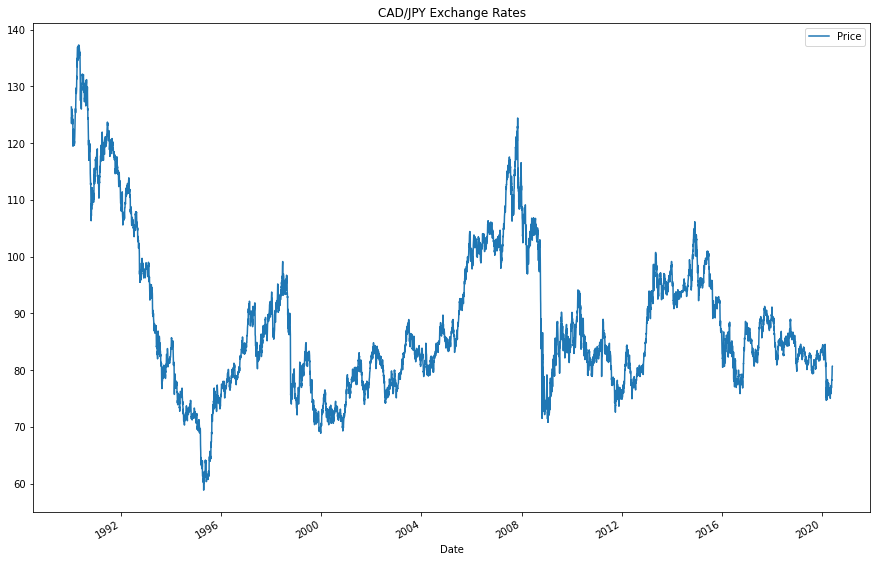
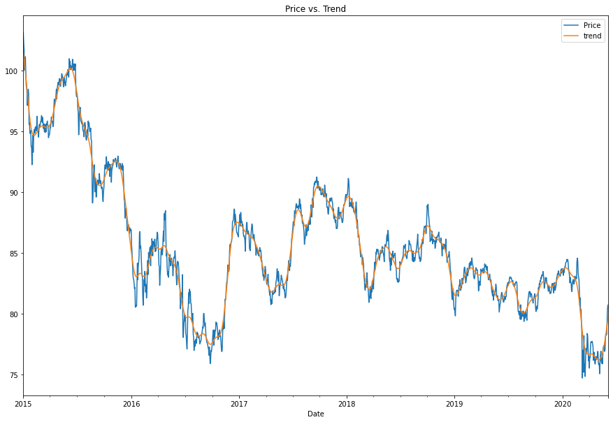
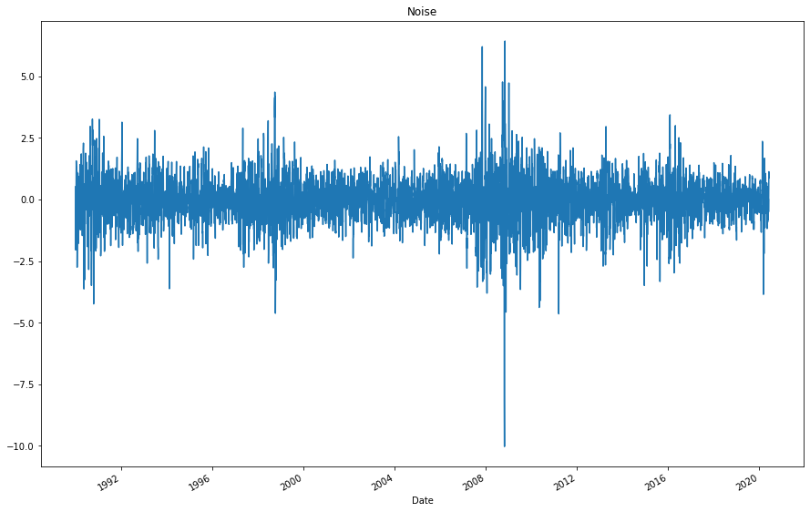
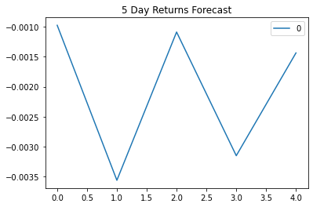
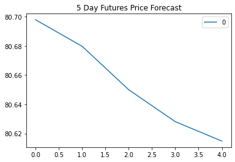
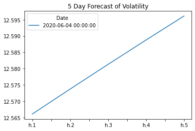
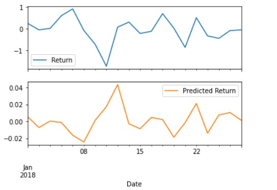

# Time Series Analysis Of The Future Yen
This project is an analysis of the future movements of the value of the Canadian dollar versus the Japanese yen. It uses time series forecasting and linear regression forecasting. It includes two Jupyter notebooks, one for each type of forecast. Historical CAD-JPY exchange rate data is used for the time series analysis and modelling. Below are the summary of the models used in this analysis and the findings.

## Summary of The Models
**Time Series Forecasting:**

Three models were used including: ARMA, ARIMA, and GARCH. Prior to using the models, an analysis of the price, and a decomposition of the price into trend and noise using the Hodrick-Prescott Filter was completed.

* ARMA Model:
This model used an order=(2, 1), and was fitted to the returns data.

* ARIMA Model:
This model was fitted using the raw CAD/JPY exchange rate price, and used an order=(5, 1, 1).

* GARCH Model:
This model used an order=(2, 1), and was fitted to the exchange rate returns (the same as the ARMA model).

**Linear Regression Forecasting:**

A Scikit-Learn linear regression model was used to predict CAD/JPY returns with lagged CAD/JPY futures returns. The data was prepared by creating returns and lagged returns, and it was then split into training and testing data. Predictions were made using the testing data.

In addition, the model was evaluated using out-of-sample data vs in-sample data.

## Summary of The Findings
**Time Series Forecasting:**

The plot of the price of the Yen below, shows that there is a lot of volatility in both the long-term and short-term. Also, the mean price in the long-term seems to be somewhat constant. However, from around 1990 to 2020 the price has declined overall.

The following plot of the exchange rate price vs. the trend for 2015 to present shows that the price is decreasing in the long-term.

This plot of the noise for 1990 to 2020 shows the volatility clusters. 

* ARMA Model

The plot below shows the volatility in the 5 day returns forecast. 

It should be noted that based on the p-value for the 2nd AR which was 0.14 (p>0.05), the model was not a good fit.

* ARIMA Model

The following plot shows a forecast fall in price of the Yen in the near term.

* GARCH Model

The plot below shows that the GARCH model forecasts a rise in volatility in the near term.

In conclusion, the time series analysis leans towards a negative yen future. The price is forecast to fall, while the volatility is forecast to rise. 

**Linear Regression Forecasting:**

The following plot shows that the first 20 predicted returns are overall lower than the actual returns.

Finally, the out-of-sample vs in-sample analysis of the linear regression model showed that the model performs better on out-of-sample data.